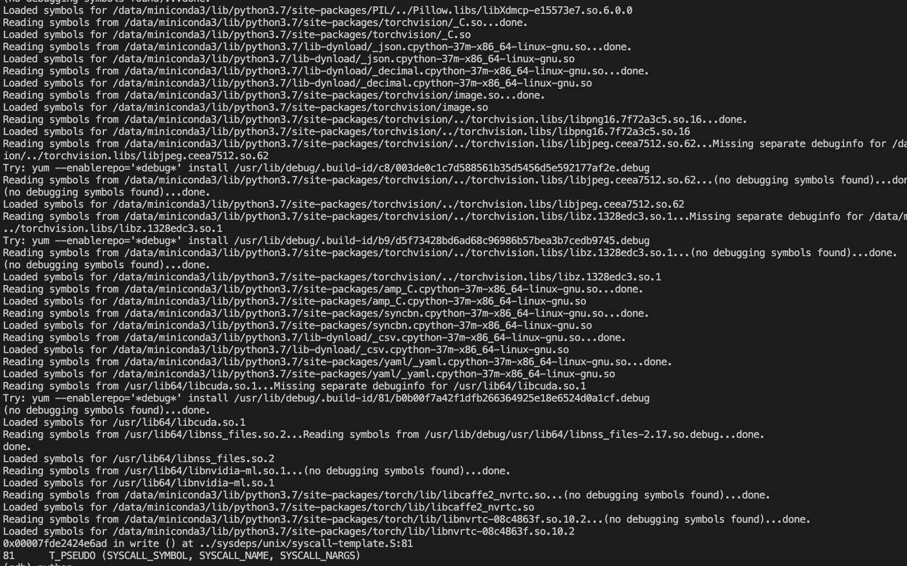

> 对于单机多卡任务，有的时候会遇到训练程序卡主不动，卡在某一个epoch无法完成，这个时候现象可能是GPU已用显存非0，但是GPU整体利用率为0。这里总结了一下：通过gdb方式定位，训练代码卡在了程序的哪个位置，方便更好的定位问题。

## 排查方法

### 1. 登录到训练的节点：按顺序安装以下rpm包

```bash
sudo yum -y install yum-utils
sudo debuginfo-install glibc
sudo yum install gdb python-debuginfo
```

如果出现安装失败可以参考<https://blog.csdn.net/github_40094105/article/details/81287572>
7

### 2. 根据对应的python版本下载libpython.py

下载地址：<https://github.com/python/cpython/blob/main/Tools/gdb/libpython.py>

例如：使用训练代码使用的python为/data/miniconda/bin/python，则检测到python版本为3.7.7，则选择下载<https://github.com/python/cpython/blob/3.7/Tools/gdb/libpython.py>

下载代码到任意目录(或者拷贝文件内容，然后保存在某一个目录中)，例如：/root/libpython.py

### 3. 将libpython.py保存的目录，设置为PYTHONPATH中的一个目录

例如：2中保存libpython.py在/root目录，则设置PYTHONPATH如下

```bash
export PYTHONPATH=/root:$PYTHONPATH
```

### 4. 首次使用gdb调试

使用和训练代码一个的python进行调试，将gdb的attach到一个卡主的进程进程

```bash
# 使用ps -ef 找到某一个卡主的程序
# 例如对于pytorch多卡程序，卡主的可能是主进程下面的某一个子进程，那么可以选择其中一个子进程attach进去
# 例如训练中使用/data/miniconda/bin/python对应的python解释器进行训练，那么可以如下进行gdb attach
gdb /data/miniconda3/bin/python -p 1179
```

成功后，会看到Loaded symbols相关的信息。

另外如果加载的时候提示，缺少某一个gdb库包时，按照提示方法直接退出gdb，然后执行安装。


### 5. 导入libpython库

```
(gdb) python
>sys.path.insert(0, "/root/libpython.py")  # 本质上如果按照上面设置了PYTHONPATH则不需要insert
>import libpython
>end
```

### 6. 查看对应卡主的代码位置

1. 使用py-list和py-bt搭配查看训练代码卡主的位置

```
(gdb) py-list
 488            else:
 489                # Copy to a buffer, then serialize that
 490                buf = io.BytesIO()
 491                storage._write_file(buf, _should_read_directly(buf), False)
 492                buf_value = buf.getvalue()
>493                zip_file.write_record(name, buf_value, len(buf_value))
 494    
 495    
 496    def load(f, map_location=None, pickle_module=pickle, **pickle_load_args):
 497        """Loads an object saved with :func:`torch.save` from a file.
 498    
(gdb) py-bt
Traceback (most recent call first):
  <built-in method write of _io.FileIO object at remote 0x7fdd07919b40>
  <built-in method write of _io.BufferedWriter object at remote 0x7fdd095b5410>
  <built-in method write_record of PyCapsule object at remote 0x7fddc75cec30>
  File "/data/miniconda3/lib/python3.7/site-packages/torch/serialization.py", line 493, in _save
    zip_file.write_record(name, buf_value, len(buf_value))
  File "/data/miniconda3/lib/python3.7/site-packages/torch/serialization.py", line 372, in save
    _save(obj, opened_zipfile, pickle_module, pickle_protocol)
  (frame information optimized out)
  (frame information optimized out)
  (frame information optimized out)
  File "main.py", line 448, in <module>
```

2. 对于该进程存在多线程卡主的时候，可以执行thread相关命令(如下)查看对应线程卡在哪里

```
(gdb) thread apply all py-list

Thread 19 (Thread 0x7fddbc2c0700 (LWP 1196)):
Unable to locate gdb frame for python bytecode interpreter

Thread 18 (Thread 0x7fddbbabf700 (LWP 1197)):
Unable to locate gdb frame for python bytecode interpreter

Thread 17 (Thread 0x7fddbb2be700 (LWP 1203)):
Unable to locate gdb frame for python bytecode interpreter

Thread 16 (Thread 0x7fddbaabd700 (LWP 1206)):
Unable to locate gdb frame for python bytecode interpreter

Thread 15 (Thread 0x7fddb88e6700 (LWP 1219)):
Unable to locate gdb frame for python bytecode interpreter

Thread 14 (Thread 0x7fdcd1fff700 (LWP 3056)):
Unable to locate gdb frame for python bytecode interpreter

Thread 13 (Thread 0x7fdcd17fe700 (LWP 3057)):
Unable to locate gdb frame for python bytecode interpreter

Thread 12 (Thread 0x7fdcd0ffd700 (LWP 3058)):
Unable to locate gdb frame for python bytecode interpreter

Thread 11 (Thread 0x7fdc7dfff700 (LWP 3059)):
Unable to locate gdb frame for python bytecode interpreter

Thread 10 (Thread 0x7fdcee7bc700 (LWP 6538)):
 410                # poll() has a resolution of 1 millisecond, round away from
 411                # zero to wait *at least* timeout seconds.
 412                timeout = math.ceil(timeout * 1e3)
 413            ready = []
 414            try:
>415                fd_event_list = self._selector.poll(timeout)
 416            except InterruptedError:
 417                return ready
 418            for fd, event in fd_event_list:
 419                events = 0
 420                if event & ~self._EVENT_READ:

Thread 9 (Thread 0x7fdcef7be700 (LWP 6557)):
 291            self._waiters.append(waiter)
 292            saved_state = self._release_save()
 293            gotit = False
 294            try:    # restore state no matter what (e.g., KeyboardInterrupt)
 295                if timeout is None:
>296                    waiter.acquire()
 297                    gotit = True
```

后续分析，可以根据卡主的位置搜索相关可能的问题。

例如对于上述的结果，检测到有相关问题出现在pytorch社区issue中。可能是在数据加载过程中worker数过大导致。

相关问题如下：

- <https://blog.csdn.net/qq_36158230/article/details/120720880>
- <https://discuss.pytorch.org/t/dataloader-stucks-whenever-start-training/89860/3>
- <https://github.com/pytorch/pytorch/issues/33296>
- <https://zhuanlan.zhihu.com/p/336863012>

## 参考文章

1. <https://wiki.python.org/moin/DebuggingWithGdb>
2. <https://fedoraproject.org/wiki/Features/EasierPythonDebugging>
3. <http://droettboom.com/blog/2015/11/20/gdb-python-extensions/>
4. <https://blog.csdn.net/github_40094105/article/details/81287572>
5. <https://github.com/python/cpython/blob/3.6/Tools/gdb/libpython.py>
