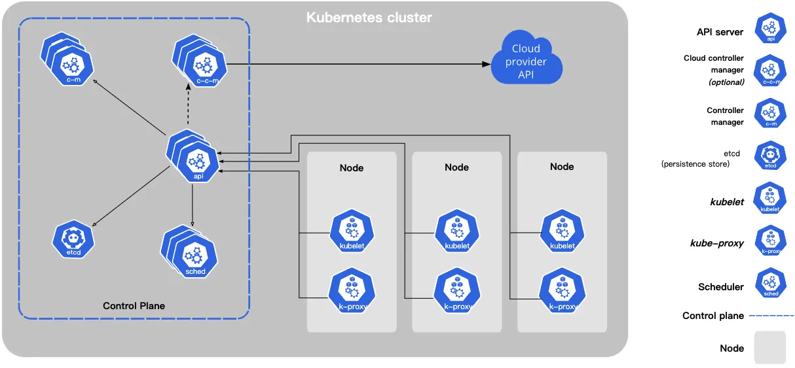
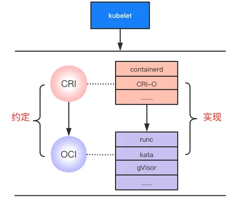
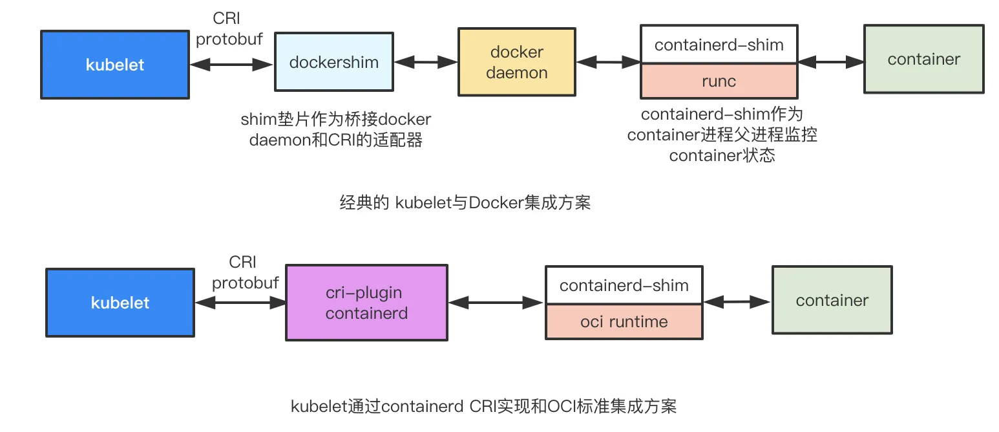

> CRI/CRI-O/OCI/containerd/Docker/runc...这些与kubernetes容器生态相关的各种术语总有一款会让初来乍到的你混淆不清。但是当我细细梳理了这些词汇之间的关系后，似乎发现了一些隐藏在大厂之间的博弈后留下的设计模式哲学。

容器生态包含了大量的行业专业术语，并且这些可能会让初次踏入的人迷惑甚至混淆的术语，都和容器生态的大公司之间的相互博弈的结果息息相关。而正是这些大公司博弈后制定的标准，使得kubernetes生态系统在不同厂商甚至操作系统之间可以更具灵活性，减少对单个公司项目的依赖。

## 从 Docker != 容器 开始

容器本质上一种轻量级的虚拟化技术，通俗的讲提供应用程序一个被隔离的可运行的环境，并且这个环境可以方便的移植部署到其他地方，那么既然是技术，那么做到上述的要求的实现可以是多种多样的，不同的厂商公司可以按照他们的理解去实现这套虚拟化技术，也就出现后文所说的Kata容器/gVisor等。而Docker可以认为是包含了容器的一种实现技术（runc），容器镜像，以及一切运行应用程序所需要的“配套设施”，它是对于应用开发的用户来说，体验友好的配套方案和工具集合。
然后，随着kubernetes的蓬勃发展，越来越多的公司开始使用kubernetes来管理集群和应用，这也导致不同公司希望根据自己理解和需求使用不同的容器技术来运行应用。换句话说kubernetes和容器底层实现是相互解耦的，那么想要做到这两者的解耦，入手就是从制定接口或者规范开始。

## 从 接口与规范 到 具体实现

简单了解kubernetes可以知道，创建一个pod本质上就是通过RESTful api请求api-server，然后kubernetes根据控制层（control plane）来决定此pod如何编排，并最终将创建的请求移交给集群中的某一台node上的kubelet，也就是说从kubelet开始创建真实的容器。


<center>图1</center>

从kubelet开始，请求会先经过CRI（Container Runtime Interface）---- High Level Runtime 传递下去，然后再经过OCI （Open Container Initiative）规范实现的 ---- Low Level Runtime 创建和启动一个容器。**似乎**整个流程就是**kubelet->CRI->OCI->container**，但是这些运行时作用和本质到底是什么，为什么要这样设计，我们围绕下面这张图来阐述。


<center>图2</center>

### CRI： 本质就是一个protobuf定义的rpc接口

CRI 定义在kubernetes项目中kubelet下（kubelet/apis/cri/runtime/v1alpha2/api.proto）这些接口包括了两个Service, 一个是专门用于管理容器的接口集合，包括create/stop/start/remove/list等操作，而另一个专门负责镜像管理接口集合，包括pull/remove/list等操作。<p>
既然定义了rpc接口，肯定会有client端和server端，所以从kubernetes的角度看，CRI的client就集成在kubelet内，而server端就是基于CRI定义的操作集合实现的各类所谓的High Level Runtime, 换句话就是从上游kubelet拿到gRPC请求，然后根据请求向下执行接口声明的众多操作，其中一些操作例如镜像管理，当前的High Level Runtime可以处理完成，而涉及到运行真实的容器则需要将请求转交给下面的Low Level Runtime，也就对应下文说的OCI的实现。<p>
既然定义了CRI这个接口，**那么实现这个接口的服务端也可以是不一样的**。因此也就有了containerd和CRI-O两种实现。containerd来自于Docker, 并且目前通过一种CRI plugin的方式使其与CRI接口兼容。类似一个rpc服务端，是一个守护进程，等待上游的rpc请求，收到请求后可以**推送/拉取镜像，管理存储网络，并且创建/运行/监控容器的运行**等功能。与containerd相对应的CRI-O是另一个由Ret-hat发起的，更加精简的实现方案。正如上文所说，无论CRI接口怎么实现，其中都要有能力创建运行的真正的容器，即会将请求移交到更低级别运行时处理，例如操作系统这一层应该如何创建，使用的镜像应该符合什么标准。这些都需要有一个规范来约束，从而使各个厂商根据不同的需求实现的容器都可以兼容CRI实现层。这个时候OCI这个概念就应运而生了。

### 开放容器标准只是一个规定

OCI规定了容器应该如何运行，包括哪些状态，生命周期的管理标准，以及容器镜像标准大概是什么，具体细则可以[参考此链接](https://github.com/opencontainers/runtime-spec/blob/main/spec.md)。既然OCI是一个标准，那么肯定也有对应这个标准的众多实现，其中runc就是第一个符合OCI各项规范和标准的参考实现（reference implementation）。换言之，runc会用Linux内核系统调用（cgroup/namespace）创建操作容器。当然除了runc是一个实现外，现在比较知名的kata-container runtime以及google的gVisor也是OCI规范的一个实现，区别点就在后两者是强隔离容器，即容器运行在一个类似轻量级的虚拟机内，一个容器属于一个轻量级虚拟机，对于多租户平台上的用户有着更高的安全性（无法从一个容器内部攻击宿主机或者其他租户容器）。
<p>
让我们再回到CRI，docker本身是先于kubernetes出现的，在最早没有CRI的时候，docker可以认为是被固定到kubernetes上的，那么固定的方法就是通过一个dockershim的组件，来桥接kubelet和docker之间的交互。然而kubernetes从v1.20开始正式放弃对Docker的支持（当然放弃支持并不是不能在kubernetes集群中使用docker集成的运行时，而是指不建议将docker作为底层运行时，即不使用dockershim和docker daemon这套集成运行时，但是仍然可以使用OCI标准中规定符合镜像要求的docker镜像），也从侧面看出CRI的出现，让kubernetes可以兼容不同的High Level Runtime，让不同的厂商分得一杯羹。下图中分别描述了经典kubelet与Docker的集成方案和现在选择containerd实现的CRI运行时配合某一oci实现的运行时的集成方案的区别，对于后者可以将containerd替换成上文说的CRI-O，并且oci runtime也可以任意选择不同厂商的容器实现方案。


 <center>图3</center>

## 巧妙的桥接模式

仔细的在查看一下图2，是不是很像设计模式中的"桥接模式"。下面是桥接模式的一个定义。

```
- 桥接是一种结构型设计模式，可将业务逻辑或一个大类拆分为不同的层次结构， 从而能独立地进行开发。
- 层次结构中的第一层 （通常称为抽象部分） 将包含对第二层 （实现部分） 对象的引用。
- 抽象部分将能将一些 （有时是绝大部分） 对自己的调用委派给实现部分的对象。 所有的实现部分都有一个通用接口， 因此它们能在抽象部分内部相互替换。
```

根据上面的定义，再来对照CRI和OCI，两者对应的两个不同层次结构，一个是High Level Runtime,一个是Low Level Runtime, 其中CRI抽象层包含了OCI实现对象的引用。CRI和OCI都是抽象层，并且对自己的调用都会委派给各自实现部分的对象。并且也是最重要的，他们能在抽象部分内部相互替换，换句话CRI的实现可以和OCI的实现相互组合，组合方式甚至理论上可以m*n种（m表示CRI的实现数量，n表示OCI实现数量）。如果用go语言来模拟CRI和OCI之间的关系，可以大致代码如下表示。

```
package main

import "fmt"

// CRI抽象层
type CRI interface {
    createContainer()
}

//  OCI抽象层
type OCI interface {
    runRealContainer()
}

// containerd --- 对应CRI实现层（struct嵌套interface）
type Containerd struct {
    OCI OCI
}

func (c *Containerd) createContainer() {
    fmt.Println("use containerd as high level runtime")
    c.OCI.runRealContainer()
}

// CRIO --- 对应CRI实现层
type CRIO struct {
    OCI OCI
}

func (c *CRIO) createContainer() {
    fmt.Println("use CRI-O as high level runtime")
    c.OCI.runRealContainer()
}

// Runc --- 对应OCI实现层
type Runc struct {
}

func (r *Runc) runRealContainer() {
    fmt.Println("use runc to run container")
}

// kata --- 对应另一种OCI实现层
type Kata struct {
}

func (k *Kata) runRealContainer() {
    fmt.Println("use kata to run container")
}

// 模拟真实过程
func main() {
    runc := &amp;Runc{}
    containerd_runc := &amp;Containerd{OCI: runc}
    containerd_runc.createContainer()
    fmt.Println("------------------------")
    containerd_oci := &amp;Containerd{OCI: &amp;Kata{}}
    containerd_oci.createContainer()
    fmt.Println("------------------------")
    ocio_runc := &amp;CRIO{OCI: runc}
    ocio_runc.createContainer()
    fmt.Println("------------------------")
    crio_oci := &amp;CRIO{OCI: &amp;Kata{}}
    crio_oci.createContainer()

}
```

模拟结果如下

```
use containerd as high level runtime
use runc to run container
------------------------
use containerd as high level runtime
use kata to run container
------------------------
use CRI-O as high level runtime
use runc to run container
------------------------
use CRI-O as high level runtime
use kata to run container
```

最后，我们可以看到大厂博弈后的结果，都是!!#ff0000 定义CRI接口，定义OCI规范!!，开放的接口和规范意味着可以其实现可以任意组合，而不会绑定到某一种实现上。在深层次上似乎也是一种哲学，一种可以借鉴的设计模式吧。

## 附录

- [Kubernetes 中的容器运行时 – 云原生实验室 - Kubernetes|Docker|Istio|Envoy|Hugo|Golang|云原生](https://fuckcloudnative.io/posts/container-runtime/)
- [CRI-O 简介 – 云原生实验室 - Kubernetes|Docker|Istio|Envoy|Hugo|Golang|云原生](https://fuckcloudnative.io/posts/cri-o/)
- [K8s宣布弃用Docker，千万别慌！](https://mp.weixin.qq.com/s/GHjvvTJ8ZerIyCqXB1BSUQ)
- <https://www.tutorialworks.com/difference-docker-containerd-runc-crio-oci/#:~:text=runc%20provides%20all%20of%20the,create%20and%20run%20container%20processes>.
- [K8S Runtime CRI OCI contained dockershim 理解（转） - charlieroro - 博客园](https://www.cnblogs.com/charlieroro/articles/10998203.html)
- [Kubernetes Components | Kubernetes](https://kubernetes.io/docs/concepts/overview/components/)
- [Container Runtimes Part 1: An Introduction to Container Runtimes - Ian Lewis](https://www.ianlewis.org/en/container-runtimes-part-1-introduction-container-r)
- [Container Runtimes Part 2: Anatomy of a Low-Level Container Runtime - Ian Lewis](https://www.ianlewis.org/en/container-runtimes-part-2-anatomy-low-level-contai)
- [Container Runtimes Part 3: High-Level Runtimes - Ian Lewis](https://www.ianlewis.org/en/container-runtimes-part-3-high-level-runtimes)
