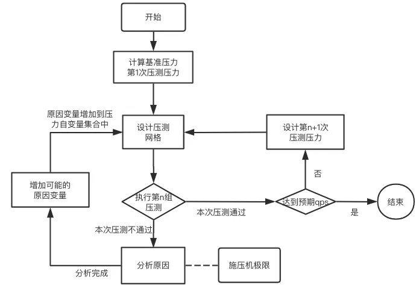

> 压测本质上就是在一个期望的平均响应时间设定内，通过调整并发数，来压出是否系统满足要求的最大期望的QPS, 在正式上线前发现潜在的问题和风险，做到提前预估资源使用，做到当问题来临时可以通过预案化解危机。

## 背景

我第一次接触到压测的时候，事实上是完全无概念的，只是先找一款压测工具，顺着压测工具提供的能力，执行几次大请求量的测试，但是怎么设置合理的压测压力，压测后的如何有效分析成功和失败率成因，这些也是完全没有概念的。

本文主要从过去完成的一次压测经验入手，总结了一下当我之后再次需要压测的时候，如何完成压测设计和压测后分析的方法论。另外，** 本文不对任何压测工具进行介绍**（因为我本人也并没有对压测工具领域有深入分析）

## 后台系统可能遭遇的压力

简单的说，对于后台服务压力源就是海量请求。这些流量压力最终都会转移到后台的服务使用的数据库缓存服务（cpu/内存/连接数）,机器硬件资源(cpu/内存/网络连接数),以及其他下游服务。具体的表现可以是：

1. 整体表现就是此接口的请求的失败率增加，例如请求大面积超时。
2. 机器硬件资源使用率达到瓶颈，例如cpu跑满/内存不足/或者是出现大量tcp time_wait连接导致无法创建新的连接请求。
3. 数据库或者缓存服务使用率达到瓶颈，cpu达到100%，内存不足，以及已用连接数达到上限。
4. 其他下游子服务处理能力不足.

## 概念说明

在开始描述压测过程前，必须要理解一些基本的概念。

- ** QPS(Queries Per Second)**:每秒完成查询/请求数；一台服务每秒能够完成响应的次数，换言之就是一个服务器的吞吐量。具体公式如下：
$$
QPS=\frac{总请求数}{总时长}
$$
- ** 并发数**:施压机器同时发起的请求的线程数(记为C)。在往传输层的角度看，假如施压方方与被压方通过rpc协议完成请求，且通过tcp协议完成网络传输，那么一个线程可以上对应一个tcp长连接(当然这也取决于主调被调的具体实现)，一个tcp长连接，可以在压测期间完成多次请求发送，即一个线程可以在压测期间完成多次请求。另外需要注意：并发数与压测机的能力强相关，是有上限的，当超过并发数超过上限，则压测结果是不准确的。
- **平均响应时间**:响应时间是一个请求从发出到处理完成接收到响应的总时间，这里我们记L为平均响应时间。
- 上面三者的关系大致如下（设总请求数为n, 压测时长为T）
$$
\begin{aligned}
&QPS=\frac{n}{T}=\frac{总请求数}{总时长}\\
&L=\frac{C*T}{n}=\frac{并发数*压测时长}{总请求数}
\end{aligned}
$$

## 压测过程

由上面的三个概念就可以知道，压测本质上就是在一个期望的平均响应时间耗时设定内，通过调整并发数，来压出最大期望可能的QPS上限。

**整体的流程化成对应的流程图为如下所示**

### 1. 根据主调限定的超时时间和期望最低QPS，预估出施压机的并发数

假设上游主调限制的超时时间为MaxL,而期望响应时间为L,即平均响应时间。那么
$$
\begin{aligned}
L<MaxL
\end{aligned}
$$

- 假设上游约束调用下游的超时时间为300ms,那么可以设定被调服务期望的平均响应为250ms(真实可能远小于250ms),以L为250ms作为压测的响应时长基准。
- 压测的过程是一个对期望QPS逐步上升的过程。所以需要设置基准QPS，假设这里我们设定基准QPS是每秒成功处理4000请求（注意这个时候，其实我们不知道上游可能的qps可能会有多少）。
- 根据250ms的平均响应，可以预估出一个线程或者对于tcp一个连接,1s可以完成4次请求,那么如果一个并发一秒可以处理4次请求，那么如果要成功做到4000qps的系统最低要求，那么根据上面的公式，需要设定的并发数为 0.25s *4000个/s = 1000并发数, 即1000个并发下可以做到满足4000qps的系统要求
$$
\begin{aligned}
基准并发数=\frac{L*n}{T}=L*QPS
\end{aligned}
$$

### 2. 设计压测实验网格，根据前一轮压测结果设计下一轮的压测压力，试探压测机极限

实验网格，本质上可以是一个excel表，在每一次压测满足预期的时候，设计下一次压测在更大压力情况下的实验。例如下面的一个表
|第x次压测|期望QPS|期望平均响应|并发数（连接数）|压测时长|成功率|实际平均响应|p90等分位响应耗时|观察到的现象|
|:-:|:-:|:-:|:-:|:-:|:-:|:-:|:-:|:-:|
|1.(基准实验)|4000|250ms|1000|5min|100%|100ms|140ms|存储/下游服务/机器资源使用表现等|
|2.(加压)|8000|100ms|1000|5min|-|-|-|-|
|3.(施压机极限试探)|8000|100ms|3000|5min|0.1%|-|-|-|
|4.(再加压)|10000|100ms|1500|5min|-|-|-|-|
|5.(再加压)|12000|100ms|2000|5min|-|-|-|-|
|x|...|...|...|...|...|...|...|...|

例如上表第一次压测就是根据上一小节预估的的基准QPS进行压测, 当第一次压测成功率符合预期，响应时间小于等于预期的时候，可以根据这一次的压测过程的实际平均响应时间，设计下一次的压测压力。

1. 实验1中，实际平均响应耗时只有100ms，为期望平均耗时的一半，那么在下一次压测时，可以增大期望QPS数，即在并发数不变的情况下，QPS数翻倍，观察整个压测过程。
2. ** 试探施压机的能力上线**：假如第2次实验的压测的成功率和期望响应均通过，可以在第3次实验中，尝试对施压机的并发数进行翻倍。如果在期望qps不变的情况下，并发数翻倍，如果**请求成功率骤减**，或者**响应耗时陡升**，则说明已经超过了施压机的能力上限。
3. 在确定了施压机的并发上限后，就可以逐步增大期望qps和期望并发数，来对系统进行后续的压力测试。
需要注意的是：只有在一轮实验符合期望后（例如成功率大于99.99%，99分位响应时间低于上游超时时间等）才能设计下一轮的实验压力。如果出现这一轮大量指标不符合预期则需要引入更多观测点，排查原因（关于可能的排查点，可以查看下一章节的案例梳理）

### 3. 引入更多指标，分析长尾请求

当本次压测，成功率过低，或者请求响应增大,或者耗时在p90/p99/p999分位过大的时候，就需要立刻分析现象的原因。而分析的原因就需要引入更多的观测和指标。下面列出了一些可能观测点。

- 自身服务相关：分析日志是否tcp连接数耗尽例如出现大量time_wait，是否cpu内存等使用率达到上限，再深入内存是否有泄漏或者服务线程协程数过多，gc回收速度等等问题。
- 存储服务相关：是否出现了大量慢查询，缓存命中失败等，通过存储服务平台监控确实cpu/内存/连接数是否达到上限。
- 调用下游服务是否达到了最大qps上限等
- 施压机创建和施压过程，可能会影响到初始请求以及期望qps
- 引入上面更多的指标，可以帮助分析诸如压测起始阶段请求出现小概率失败的原因，或者某一阶段突发的失败率上升的小量失败原因，这些少量失败的请求，可以定义为长尾请求，这一部分的分析其实也是最难得。

在每次定位到一个问题所在时，本质上也可能引入一个或者几个其他的变量，例如下面案例举例中，引入了DB连接数的多个参数。

### 4. 真实案例举例

之前碰到过当对服务压测过程中，出现大量cannot assign requested address日志时，这种情况属于比较常见，自己接口服务器的端口耗尽无法与下游服务建立tcp链接导致的。
排查的过程主要是以下流程：

1. **引入连接状态指标**：比较常见的无法分配请求地址的原因主要是由于连接TIME_WAIT状态过多导致的，所以需要在压测的过程中，采集TIME_WAIT状态的连接，找出TIME_WAIT过多的连接，都是和哪个ip连接的。例如通过netstat -ant等脚本，可以在服务器上周期性采集与哪些ip的连接出现了过多的TIME_WAIT.(关于TIME_WAIT的出现，大家可以自行搜索理解)
2. **定位time_wait ip对应的服务**：通过定位发现，是由于与mysql数据库和redis的连接，均出现了大量的TIME_WAIT.那么可以初步定为到，可能是由于服务与存储服务的连接池不合理的使用导致大量请求失败。
3. **研究服务中所使用相关连接池的设置和实现**：服务中mysql使用了go-sql-driver/mysql中的连接池，而redis使用了redigo的实现作为连接池，所以分析也就着眼于这两个框架的底层实现。
4. **深入源码，最终发现**：
   - redis连接池理解偏差: 根因是由于设置了redis连接池参数，max_idle < max_active导致。
   - mysql连接池理解偏差：根因是由于mysql连接池参数，max_idle< max_open 导致，和redis连接池理解偏差是一样的。
   - 而触发的原因，**不是因为压力过大导致，而是由于压力不够**，导致redis和mysql的连接频繁出现回收导致关闭。再深入到源码级别后，就会发现go-sql-driver/mysql以及redigo中对于**空闲连接**和**最大空闲连接数**以及**最大空闲时长**的定义本身，我是理解错误的。并非是某一个连接在超过设定的最大空闲时间没有任何数据传递才会被回收，而是根据连接队列或者当前连接整体使用情况综合判定的。

5. **最终服务改进方案**：将redigo中max_idle和max_active都设置成相同的，而mysql中max_idle和max_open设置成相同的。这几个参数本质上也变成了，压测实验网格中的自变量，参与到压测实验中。

## 总结

本文根据我自己在实践中对某一个rpc接口做压测的过程的整理，梳理了一套我自己的方法论，的确也有很多不足，但是也希望提供给一些第一次做压测的同学，一些基础的指引。本质上压测过程发现问题，本质上都是一次深入理解系统框架全链路的过程。在正式上线前发现潜在的问题和风险，做到提前预估资源使用，做到当问题来临时可以通过预案化解危机。
