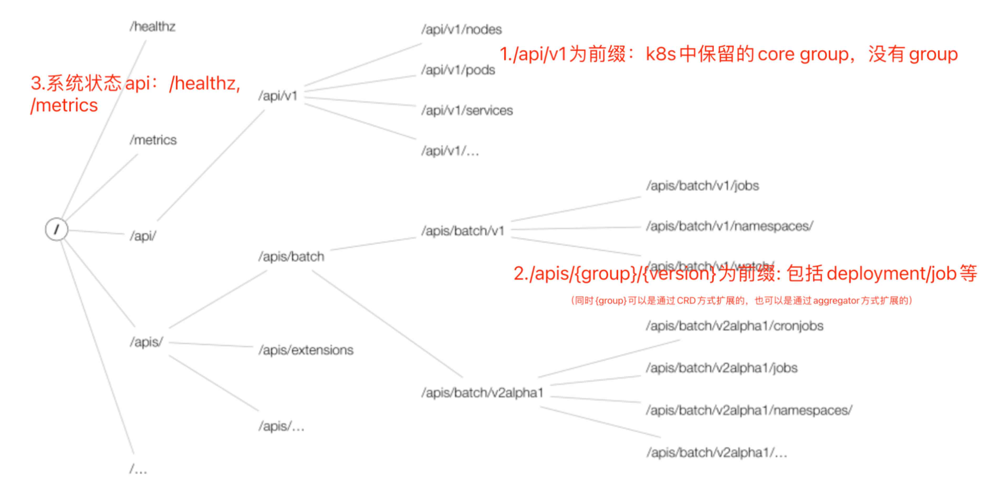

> 我在首次接触k8s最头疼的问题是，面对上百万行错综复杂的代码，到底应该如何抓住"主次"，从哪一个文件看起。很多源码分析的教程更多的是从cmd/kube-apiserver开始，诚然这是一个从零开始debug的手段，但是debug一会儿就会陷入非常深的调用链的细节，导致整个过程痛苦不堪，这里我想<font color=red>从一个pod从请求到创建再到整个生命周期角度</font>，以方式聊聊源码，这种方法会让阅读变得更加简单。

# 从理解API结构开始

&emsp;&emsp;k8s中一个特定restful URL Path 对应着一个固定的资源. 一般而言一个URL Path如下由几个部分构成

```
/[{apis}|{api}]/[{group}]/{version}/namespaces/{namespace}/{resource}/{object实体名}[/simple资源]
```

&emsp;&emsp;注：simple资源主要是给特定对象的特定动作使用，非持久化，例如/pods/{object name}/status 可以用来对pod对象修改状态

&emsp;&emsp;有了URL  path，那下一步就是定位到path是如何同具体的处理逻辑相绑定的，即如何进行路由的。这里我们以pods作为上面URL Path中的resource，来分析register逻辑。这里先说结论，对于pods资源的相关处理逻辑主要在 vender/k8s.io/apiserver/pkg/endpoints/installer.go文件中APIInstaller中的registerResourceHandlers方法。

&emsp;&emsp;此函数的操作是将一个具体资源对应的restful URL path按照restful架构遵循的统一接口原则，进行资源注册，即给每个资源对应的http方法，例如GET, PUT, POST, PATCH,DELETE 注册不同的函数执行逻辑，以此来完成对特定资源实体的增删改查能力。

&emsp;&emsp;上面，我们只从最小维度（针对某一个URL）简述注册逻辑，我们从一个宏观的角度来看看整个apiserver启动时候，都经过了哪些处理。宏观上apiserver，通过不同的URL path前缀将APIserver分成三种。分别是一个包含内置API对象的<font color=red>KubeAPIServer</font>和两个不同方式用于扩展服务的<font color=red>APIExtensionsServer</font>和<font color=red>AggregatorServer</font>。下面是部分前缀对应不同的server示例
<table>
    <tr>
        <th>server类型</th><th>URL前缀</th><th>举例 </th>
    </tr>
    <tr>
        <td rowspan="2">apiextensions-apiserver</td>
        <td>/apis/apiextensions.k8s.io/</td>
        <td>customresourcedefinations, customresourcedefinations/status</td>
    </tr>
    <tr>
        <td>/apis/{自定义group}</td>
        <td align="left">例如安装kubeflow/training-operator后，可以使用/apis/kubefow.org/v1/namespace/{ns}/pytorchjobs/{name}
路由路径匹配过程如下：匹配/apis/->不匹配所有goRestfulContainer已经注册的前缀->匹配/apis/kubeflow.org/v1/前缀对应nonGoRestfulMux->crdHandler
        </td>
    </tr>
    <tr>
        <td rowspan="2">apiserver</td>
        <td>/api/v1</td>
        <td>pods, pods/status, pods/log, bindings,replicationControllers, nodes,events...</td>
    </tr>
    <tr>
        <td>/apis</td>
        <td>apps, authentication.k8s.io, batch, rbac.authorization.k8s.io
        </td>
    </tr>
    <tr>
        <td rowspan="2">aggregator</td>
        <td>/apis/apiregistration.k8s.io</td>
        <td>apiservices, apisevices/status</td>
    </tr>
    <tr>
        <td>/apis/{自定义group}</td>
        <td align="left">例如[安装k8s官方的sample-apiserver](https://github.com/kubernetes/sample-apiserver)后，可以使用/apis/wardle.example.com/v1alpha1/namespaces/{namespace}/flunders/{name}路由路径匹配过程如下：匹配/apis->不匹配所有goRestfulContainer已经注册的前缀->匹配/apis/wardle.example.com/v1/前缀对应nonGoRestfulMux->proxyHandler(vendor/k8s.io/kube-aggregator/pkg/apiserver/handler_proxy.go)
        </td>
    </tr>
</table>
下面是这三种Server的注册逻辑对象的关注点代码
```
# 这一部分注册分为两类，并且是"先后"注册,一类是面向CRD的APIExtensions服务,另一类是面向k8s内置API对象的APIServer
- createAPIExtensionsServer(...) # --- cmd/kube-apiserver/app/server.go
  - completedConfig.New(...) # -- vender/k8s.io/apiextensions-apiserver/apiserver.go
    - GenericAPIServer.InstallAPIGroups/APIGroupVersion.InstallREST/APIInstaller.registerResourceHandlers # 和下方注册内置API对象相同
  - 启动和CRD相关controller协程，用于"实时"将用户定义的CRD转化成对应的可执行上述增删改查的restful API
- CreateKubeAPIServer(...) # --- cmd/kube-apiserver/app/server.go
  - completedConfig.New(...) # --- pkg/controlplane/instance.go
      # 在APIServer注册中，又区分为为两类，一种是上图中/api为前缀的核心资源，例如pods/nodes/services等，另一种为/apis为前缀的资源
      - Instance.InstallLegacyAPI(...) # /api为前缀
      - Instance.InstallAPI(...) # /apis为前缀
        - GenericAPIServer.InstallAPIGroups(...) # 注册同一个以/apis前缀的所有路由（注意如果前缀是/apis则有一个特例，以apiextensions.k8s.io为group的资源组和其他资源组是分开处理的，因为apiextensions.k8s.io代表的是CRD一种扩展资源和其他原生api不一样，所以分开注册）--- vender/k8s.io/apiserver/pkg/server/genericapiserver.go
          - APIGroupVersion.InstallREST(...) # 以group+version维度进行路由注册，一个group+version对应着一个go-restful的webservice实例 --- vender/k8s.io/apiserver/pkg/endpoints/groupversion.go
            - APIInstaller.registerResourceHandlers(...) # --- vender/k8s.io/apiserver/pkg/endpoints/installer.go
    # 创建AggregatorServer,这是另一种与CRD方式不同的扩展apiserver的方式
- createAggregatorServer(... ) # --- cmd/kube-apiserver/app/server.go
```

# 当一个创建pod的请求进入apiserver

## 拦截器处理

&emsp;&emsp;在apiserver中拦截器并非使用go-restful中自带的restful.Filter方式实现的，而是使用比较朴实的方式，通过类似装饰函数的方式层层封装http.Handler，来达到请求过来后层层拦截。可以关注DefaultBuildHandlerChain(apiHandler http.Handler, c *Config) http.Handler 函数，此函数像类似入栈的顺序，先装饰的最后执行，可以看到请求进来会依次非常多的拦截处理，其中很重要的先后执行Authentication认证/Authorization授权 （注：访问控制逻辑不在此处执行，是在执行完拦截处理后）在实现上。

## 简化理解APIserver中的http服务

&emsp;&emsp;无论APIServer多么复杂，其本质仍然是使用的golang的net/http。即下方这行代码（不过源码中没有这么直白，直接调用ListenAndServe启动，具体启动逻辑可以查阅vendor/k8s.io.apiserver/pkg/server/secure_serving.go的RunServer函数）

```
s := &http.Server{
  Addr:           ":8080",
  Handler:        handler, 
 }
s.ListenAndServe()
```

&emsp;&emsp;所有的api注册逻辑可以认为是围绕实现Handler这个接口中的ServeHTTP(ResponseWriter, *Request)。但是有一个问题，上一节说APIServer使用的是go-restful库进行路由注册，来实现restful风格的API，那具体是如何实现的呢？这里我们先定位到k8s中handler接口实现对应的struct----APIServerHandler，这个APIServerHandler实现了接口中的ServeHTTP。由下方代码可以看出所有的请求处理的起点是从FullHandlerChain开始，而这个FullHandlerChain就是上文说的各类顺序执行的拦截器，拦截器的最后是一个Director，同样对应的是一个实现了http.Handler的接口的对象，而这个Direcrtor对应的就是真实处理资源增删改查的实现，而从下方的代码可以看到director包含了不同的路由方式，一个是基于go-restful的restful.Container(goRestfulContainer)，另一个是k8s自己实现的一种根据URL前缀匹配的路由mux.PathRecorderMux(nonGoRestfulMux)。那根据第一节中不同前缀对应处理的资源类型不同，可以推断这两个不同的路由方式也对应着处理不同的资源。

&emsp;&emsp;goRestfulContainer：主要用于处理核心组/api/v1，APIServer内置资源组例如/apis/为前缀的batch/apps等资源，director中会直接调用restful.Container中的Dispatch方法，来直接使用go-restful中自己实现的路由逻辑。

&emsp;&emsp;nonGoRestfulMux：主要处理通过CRD方式或者通过AggregatorServer方式扩展的资源，虽然这些资源同样以/apis前缀开头，但是可以看到在Director的实现中，会通过比对是否URL已经在goRestfulContainer中注册的方式，来判断是否执行nonGoRestfulMux路由。

```
// APIServerHandlers holds the different http.Handlers used by the API server.
// This includes the full handler chain, the director (which chooses between gorestful and nonGoRestful,
// the gorestful handler (used for the API) which falls through to the nonGoRestful handler on unregistered paths,
// and the nonGoRestful handler (which can contain a fallthrough of its own)
// FullHandlerChain -> Director -> {GoRestfulContainer,NonGoRestfulMux} based on inspection of registered web services
type APIServerHandler struct {
 // FullHandlerChain is the one that is eventually served with.  It should include the full filter
 // chain and then call the Director.
 FullHandlerChain http.Handler
 // The registered APIs.  InstallAPIs uses this.  Other servers probably shouldn't access this directly.
 GoRestfulContainer *restful.Container
 // NonGoRestfulMux is the final HTTP handler in the chain.
 // It comes after all filters and the API handling
 // This is where other servers can attach handler to various parts of the chain.
 NonGoRestfulMux *mux.PathRecorderMux
 Director http.Handler
}
type director struct {
 name               string
 goRestfulContainer *restful.Container
 nonGoRestfulMux    *mux.PathRecorderMux
}
// ServeHTTP makes it an http.Handler
func (a *APIServerHandler) ServeHTTP(w http.ResponseWriter, r *http.Request) {
 a.FullHandlerChain.ServeHTTP(w, r)
}
```

## 定位到创建的逻辑

&emsp;&emsp;有了以上的基础铺垫，下一步我们将从创建一个pod开始进行debug，通过跟踪整个pod和生命周期相关的对象的变更(比如pods/status, event)来更详细的展示pod的调度过程。

&emsp;&emsp;这里我们现将所有/etc/kubernetes/manifests的kube-apiserver.yaml/kube-controller-manager.yaml以及kube-scheduler.yaml移除（停止调度和控制组件的执行，避免pod创建后立刻进入调度流程，导致无法捕捉到状态细节），这里我们准备一个简单的pods，其对应的yaml如下

```
apiVersion: v1
kind: Pod
metadata:
  name: myapp-creater-demo
  labels:
    name: myapp-creater-demo
    app: myapp-creater-demo
spec:
  containers:
  - name: myapp-container
    image: nginx
    resources:
      limits:
        memory: "32Mi"
        cpu: "100m"
    imagePullPolicy: Always
    command: ['sh', '-c', 'nginx && sleep infinity']
    ports:
      - containerPort: 80
  nodeSelector:
     node-restriction.kubernetes.io/resource: gpu
```

&emsp;&emsp;然后打开debug，执行**kubectl apply -f creater_pod.yaml**来创建pods，跟踪pods。apply命令行为会包含两个动作----即两个restful API ，会先**查询是否存在对应名字的pods**,如果不存在则会执行create操作。根据上面的分析，接口先执行我们可以将断点定位到vender/k8s.io/apiserver/pkg/endpoints/handlers/create.go中的createHandler，另外和pod对象存储相关的可以关心 pkg/registry/core/rest/storage_core.go(其中storageNewLegacyRESTStorage是和上文说的以/api/v1为前缀的k8s核心组件相关的存储接口，对于本例可以关系的pods以及其对应的子资源pods/status)。下面我们用表格顺序梳理出整个调用链，以及调用链中关键的数据结构。

|调用顺序|文件|关键函数|以上述示例解释过程与数据结构|
|:----|:----|:----|:----|
|1|vendor/k8s.io/apiserver/pkg/endpoints/handlers/get.go|func GetResource(r rest.Getter, scope *RequestScope) http.HandlerFunc|根据上一节讲述的，注册阶段中会根据restful URL "/api/v1/namespaces/default/pods/myapp-creater-demo"映射处理逻辑，对于当前示例，请求在真实处理过程中，映射到GetResource逻辑|
|2|vendor/k8s.io/apiserver/pkg/registry/generic/registry/store.go|func (e *Store) Get(ctx context.Context, name string, options*metav1.GetOptions) (runtime.Object, error) |从文件路径的generic看出这是一个对k8s中资源进行通用存储层操作的抽象，其中尤为重要的是这个Store结构体，根据注释可以了解到Store，其目的是可以嵌入到任何K8s的Kind对象中，提供CRUD统一操作，以及一些通用的包括ResourceVersion冲突检测，创建更新删除的通用策略|
|3|vendor/k8s.io/apiserver/pkg/storage/etcd3/store.go|func (s *store) Get(ctx context.Context, key string, opts storage.GetOptions, out runtime.Object) error|在etcd中查询以"/registry/pods/default/myapp-creater-demo" 为key的对象是否存在|
|4.1|vendor/k8s.io/apiserver/pkg/endpoints/handlers/create.go|func createHandler(r rest.NamedCreater, scope *RequestScope, admit admission.Interface, includeName bool) http.HandlerFunc|1.  获取请求body体中的关于pod定义的内容|
|4.2 | -| -|2.  将body内容反序列化成对应Kind的结构体对象，可以定位序列化后的对象为定义在pkg/apis/core/types.go中的Pod结构体|
|5|vendor/k8s.io/apiserver/pkg/registry/generic/registry/store.go|func (e *Store) Create(ctx context.Context, obj runtime.Object, createValidation rest.ValidateObjectFunc, options*metav1.CreateOptions) (runtime.Object, error)|3.  紧跟上一步，开始创建，创建过程中会先执行准入控制，用来验证和修改用户设置的pod的参数是否合理|
|6.1|vendor/k8s.io/apiserver/pkg/storage/cacher/cacher.go|func (c *Cacher) Create(ctx context.Context, key string, obj, out runtime.Object, ttl uint64) error|4.  与etcd3交互，将encode为二进制，以/registry/pods/default/myapp-creater-demo为key|
|6.2 |vendor/k8s.io/apiserver/pkg/storage/etcd3/store.go|func (s *store) Create(ctx context.Context, key string, obj, out runtime.Object, ttl uint64) error|- |

&emsp;&emsp;到目前为止，关于用户定义pods的配置信息，已经写入了etcd存储中，并且可以看到Pod结构体中PodStatus结构体，记录状态的参数一直为Pending，并且对应的ContainerStatus也是空(由于已经关闭了调度进程，不会进一步的执行调度)

# 以deployments为例再来梳理一遍分析请求的全流程

&emsp;&emsp;上文我们用一个pod的创建来简单部分主要逻辑，这节我们以查询Deployment为例，执行kubectl get deployment来逐层debug分析调用链（备注：这里除去身份认证，鉴权等各种过滤情况），分析完后我相信后面如果需要查看某些代码的设计，就可以从这些调用链入手。(下面以1.25.3版本为例文件中vender/k8s.io本质上是对staging/src/k8s.io目录的软链)

|序号|文件|对应函数|备注|进入函数后关注的代码|
|:----|:----|:----|:----|:----|
|1.1|vender/k8s.io/apiserver/pkg/server/handler.go|func (d director) ServeHTTP(w http.ResponseWriter, req *http.Request) （122行）|请求已经经过所有认证鉴权等拦截器|d.nonGoRestfulMux.ServeHTTP(w, req) (154行)|
|1.2 |- | -|可以搜索相关拦截器（参考vender/k8s。io/apiserver/pkg/server/config.go相关注册代码func DefaultBuildHandlerChain(apiHandler http.Handler, c *Config) http.Handler | -|
|2|vender/k8s.io/apiserver/pkg/server/mux.go|func (h *pathHandler) ServeHTTP(w http.ResponseWriter, r*http.Request)（239行）|其上一个函数调用为func (m *PathRecorderMux) ServeHTTP(w http.ResponseWriter, r*http.Request) |prefixHandler.handler.ServeHTTP(w, r)（249行）|
|3|vender/k8s.io/kube-aggregator/pkg/apiserver/handler_proxy.go|func (r *proxyHandler) ServeHTTP(w http.ResponseWriter, req*http.Request) （112行）|这里会决定是走本地的apiserver还是通过aggragator扩展的server|r.localDelegate.ServeHTTP(w, req)(125行)|
|4|vender/k8s.io/apiserver/pkg/server/handler.go|func (d director) ServeHTTP(w http.ResponseWriter, req *http.Request) （122行）|会发现再次进入了这个函数，不同的是下一步调用的代码不一样，开始进入restful路由逻辑|d.goRestfulContainer.Dispatch(w, req) （146行）|
|5.1|vendor/github.com/emicklei/go-restful/v3/container.go|1.  func (c *Container) Dispatch(httpWriter http.ResponseWriter, httpRequest*http.Request (197行)|restful源码，关注dispatch路由逻辑|1.  c.dispatch(httpWriter, httpRequest)（204行）|
|5.2 | -|2.  func (c *Container) dispatch(httpWriter http.ResponseWriter, httpRequest*http.Request)（208行）| -|2.  route.Function(wrappedRequest, wrappedResponse) (299行)|
|6|vendor/k8s.io/apiserver/pkg/endpoints/handlers/get.go|func ListResource(r rest.Lister, rw rest.Watcher, scope *RequestScope, forceWatch bool, minRequestTimeout time.Duration) (169行)|一个restful到存储操作可以是一个一一对应关系，这里包含了从restful到etcd的操作流|result, err := r.List(ctx, &opts) （278行）|
|7.1|vender/k8s.io/apiserver/pkg/registry/generic/registry/store.go|1.  func (e *Store) List(ctx context.Context, options*metainternalversion.ListOptions)|RESTStorage实现|1.  out, err := e.ListPredicate(ctx, e.PredicateFunc(label, field), options) （335）|
|7.2 |- |2.  func (e *Store) ListPredicate(ctx context.Context, p storage.SelectionPredicate, options*metainternalversion.ListOptions) (runtime.Object, error)（347行）| - | - |
|8|vendor/k8s.io/apiserver/pkg/storage/cacher/cacher.go|func (c *Cacher) GetList(ctx context.Context, key string, opts storage.ListOptions, listObj runtime.Object)（633行）|其上一层调用可以关注DryRunnableStorage|return c.storage.GetList(ctx, key, opts, listObj)(638行)|
|9.1|vendor/k8s.io/apiserver/pkg/storage/etcd3/store.go|func (s *store) GetList(ctx context.Context, key string, opts storage.ListOptions, listObj runtime.Object)（524行）|真实的db操作层入口，可以看到deployments在etcd中对应key为"/registry/deployments/default"|1.  getResp, err = s.client.KV.Get(ctx, key, options...)（660行）|
|9.2 | -|- |获取对应的value并且反序列化value|2.  appendListItem(v, data, uint64(kv.ModRevision), pred, s.codec, s.versioner, newItemFunc) (700行)|

&emsp;&emsp;从上面的pod和deployment两个例子看，简单的来说一个RESTful API对应一个Resource，而每个Resource都需要实现rest.Storage接口。

&emsp;&emsp;当然，上面的例子其实是比较简单的apiserver的实现场景，比较复杂的场景还有使用watch方式监听资源，会用到 http 协议 chunked 机制实现，通过 在header中的Transfer-Encoding: chunked 来实现持续watch，apiserver会启动一个协程周期性的轮训并分段持续接收相应的相应。而对应使用kubectl exec -it 与pod建立交互终端 ,则是使用SPDY协议使得信息可以在单个 TCP 连接进行并发双向收发（好像近期的已经可以使用websocket，具体没有代码层面考证）

# 参考附录

1. [Kubelet 创建pod流程分析 - Kaiying](https://wukaiying.github.io/k8s/kubelet-create-pod-lifecycle/)
2. [kubelet 源码分析：pod 新建流程 | Cizixs Write Here](https://cizixs.com/2017/06/07/kubelet-source-code-analysis-part-2/)
3. [kubectl 创建 Pod 背后到底发生了什么？ – 云原生实验室 - Kubernetes|Docker|Istio|Envoy|Hugo|Golang|云原生](https://icloudnative.io/posts/what-happens-when-k8s/)
4. [How does 'kubectl exec' work? - Blog](https://erkanerol.github.io/post/how-kubectl-exec-works/)
5. <https://github.com/kubernetes-sigs/apiserver-builder-alpha/blob/master/docs/concepts/api_building_overview.md>
6. <https://github.com/duyanghao/kubernetes-reading-notes/blob/master/core/api-server/design.md>
