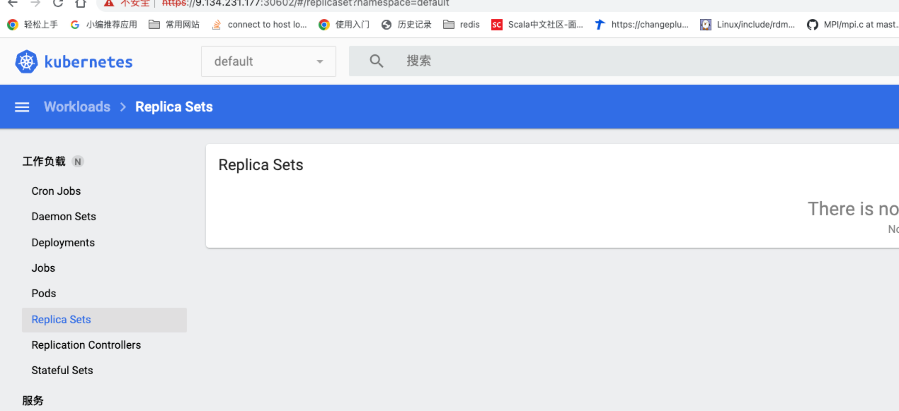
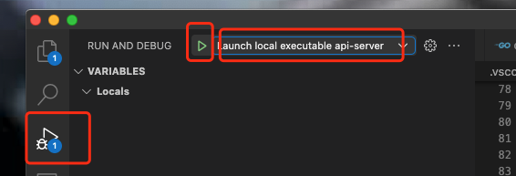
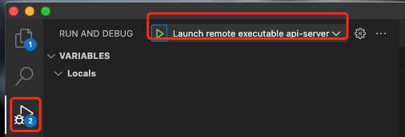
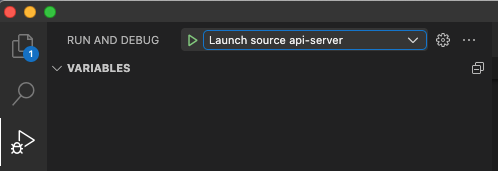

> 授之以鱼，不如授之以渔，关于k8s源码的分析，网上的文章太多了，而且随着chatGPT的出现，通过GPT来学习k8s也越来越方便(不过要注意GPT有的时候会认真的胡说八道)，但是往往要真的深入理解k8s还是要自己去读源码，最好的方法就是带着问题去找对应的源码。这篇文章也是系列文章的第一篇。

# 先有一个自己的k8s集群

这里推荐使用[kubeadm](https://kubernetes.io/docs/setup/production-environment/tools/kubeadm/create-cluster-kubeadm/)方式完成kubernetes集群的搭建，之所以不采用minikube，主要有以下几个原因：

1. 主要是使用kubeadm创建的过程中也是一个复习整个kubernetes集群组件的过程。
2. 虽然kubeadm在创建集群过程中，都能比较容易得创建集群，但是相对于minikube这种开箱即用的来说，还是有一定繁琐步骤需要自行处理。例如需要选择不同的底层组件（例如CRI和OCI的选择，可以参考[从kubernetes中容器生态窥探设计模式的哲学](./从kubernetes中容器生态窥探设计模式的哲学)这篇文章）甚至如果有多台机器，可以将在多台机器部署k8s node,在后续学习的时候，可以更真实的理解例如调度的逻辑。
3. minikube更多的可以帮助一个从没有接触过k8s的人，让其能够通过minikube上手使用k8s，来学习了解k8s的理念。
4. 因为后续我们会通过将原本的k8s集群中的某一个组件停止，替换为我们自己通过源码的编译的组件，进而对k8s的这个组件进行debug，来学习里面的一些源码，因此知道这些组件的停止启动，部署逻辑是很有必要的，所以kubeadm在这方便是更好的工具。

## 使用kubeadm搭建k8s集群的一些注意事项

kubeadm的教程已经非常详细了，所以这里我不会再将原文赘述一遍。但是在创建的集群的时候也会遇到很多坑，这里我主要说明一下我遇到的几个问题，帮助读者可以避免过多的耗费时间在这些异常问题上。本文及后续所有相关文章均以k8s v1.25.3版本为例创建集群。

1. 这里我使用了不太常用的cri-dockerd作为容器运行时（更推荐使用containerd/cri-o作为容器运行时），[GitHub - Mirantis/cri-dockerd: dockerd as a compliant Container Runtime Interface for Kubernetes](https://github.com/Mirantis/cri-dockerd) 需要注意的时候<font color=red>必须使用sudo 或者 以root用户进行安装</font>。并且安装完成并且使用systemctl命令启动后查看是否可以正常运行.
2. 务必保证/etc/crictl.yaml没有设置任何image-endpoint和runtime-endpoint配置（如果有请删除），否则kubeadm中的cri-socket选项将被覆盖
3. 在安装kubeadm/kubelet/kubectl的时候，需要指定版本，否则会默认安装最新版本，这里我安装的是1.25.3版本

```
# Installing kubeadm | Kubernetes
sudo yum install -y kubelet-1.25.3 kubeadm-1.25.3 kubectl-1.25.3 --disableexcludes=kubernetes
```

4. 这里我列出我的kubeadm init参数，这些参数有一些会和后面debug时启动的参数有关

```
# 使用cri-dockerd作为CRI
sudo kubeadm init --kubernetes-version=v1.25.3 --control-plane-endpoint=9.134.231.177 --pod-network-cidr=10.244.0.0/16 --service-cidr=10.96.0.0/12 --apiserver-advertise-address=0.0.0.0 --ignore-preflight-errors=Swap --cri-socket unix:///var/run/cri-dockerd.sock --image-repository=registry.cn-hangzhou.aliyuncs.com/google_containers
# 使用containerd作为CRI
sudo kubeadm init --kubernetes-version=v1.25.3 --control-plane-endpoint=9.134.231.177 --pod-network-cidr=10.244.0.0/16 --service-cidr=10.96.0.0/12 --apiserver-advertise-address=0.0.0.0 --ignore-preflight-errors=Swap --cri-socket unix:///var/run/containerd/containerd.sock --image-repository=registry.cn-hangzhou.aliyuncs.com/google_containers
# 重置kubeadm init生成的配置
sudo kubeadm reset --cri-socket unix:///var/run/xxxx
```

5. 如果在使用国内阿里云或者腾讯云，除了需要kubeadm 参数中使用--image-repository参数设置国内镜像仓库外。如果使用containerd的话，需要手动先生成containerd相关配置文件[containerd/getting-started.md at main · containerd/containerd · GitHub](https://github.com/containerd/containerd/blob/main/docs/getting-started.md)，并且修改对应的配置信息，如下

```
# containerd uses a configuration file located in /etc/containerd/config.toml for specifying daemon level options. 默认containerd不会有这个文件，需要手动执行此命令生成
containerd config default > /etc/containerd/config.toml
# 注意需要修改 sandbox_image配置，因为这个镜像是创建pod时，最先使用pause镜像启动进程，而后在启动真实容器。所以在kubeadm init过程中可能出现k8s控制面组件启动不起来，很大可能是由于这个镜像由于网络问题无法下载下来，需要修改为国内镜像。
sandbox_image = "registry.k8s.io/pause:3.6" 
sandbox_image = "registry.cn-hangzhou.aliyuncs.com/google_containers/pause:3.6"
```

6. 安装完成后你仍然需要选择一个cni插件进行安装，可以参考[Installing Addons | Kubernetes](https://kubernetes.io/docs/concepts/cluster-administration/addons/)
7. 如果你只有一台机器用来调试，默认情况k8s master节点是不能创建非control-plane的pod的（因为标记了相应的污点，仅允许在此节点上调度关键工作负载），所以需要移除

```
kubectl taint node <you> node-role.kubernetes.io/control-plane-
```

8. 在搭建完成后，可以使用kubernates dashboard安装可视化的UI，具体可以参考[dashboard/docs/user/accessing-dashboard at master · kubernetes/dashboard · GitHub](https://github.com/kubernetes/dashboard/tree/master/docs/user/accessing-dashboard)并且使用Service的NodePort模式（否则如果使用kubectl proxy方式访问会出现"检测到不安全的访问。无法登陆"提示），使用<node_ip>:<nodePort>方式访问dashboard

9. 登陆kubernetes dashboard建议使用此方法：创建service account并且和cluster-admin这个默认的clusterrole绑定，然后在控制节点执行kubectl -n kubernetes-dashboard create token <service account名字> 创建bearer token登录。[dashboard/creating-sample-user.md at master · kubernetes/dashboard · GitHub](https://github.com/kubernetes/dashboard/blob/master/docs/user/access-control/creating-sample-user.md)

# 使用VSCode Debug k8s组件

这里我们先以k8s的apiserver为例，进行说明

工具：

1. vscode安装插件[vscode Remote Development扩展套件](https://marketplace.visualstudio.com/items?itemName=ms-vscode-remote.vscode-remote-extensionpack)
2. 安装[delve golang语言debugger](https://github.com/go-delve/delve)

<font color=red>调试所用的源文件版本：kubernetes版本 v1.25.3 </font>

## 本地debug编译好的二进制apiserver （推荐）

注：这里的本地指的是<font color=red>代码在远端服务器上，编译好的二进制文件也在远程服务器中</font>。使用本地vscode remote插件打开远端服务器的kubernetes项目workspace进行调试.

### 1. 编译apiserver

```
make all WHAT=cmd/kube-apiserver DBG=1
```

更多编译命令可以直接查阅项目根目录下的Makefile

### 2. 配置vscode launch文件

下面是我按照第一节方法创建的k8s集群的参数，设置的调试参数，本质上就是apiserver的启动参数。

```
{
    "version": "0.2.0",
    "configurations": [
    {
            "name": "Launch local executable api-server",
            "type": "go",
            "request": "launch", 
            "mode": "exec",
            "program": "${workspaceFolder}/_output/bin/kube-apiserver",
            "substitutePath": [
                {
                    "from": "${workspaceFolder}",
                    "to": "${workspaceFolder}/_output/local/go/src/k8s.io/kubernetes",
                },
            ],
            "args": [
                "--advertise-address=172.31.124.8",
                "--allow-privileged=true",
                "--authorization-mode=Node,RBAC",
                "--client-ca-file=/etc/kubernetes/pki/ca.crt",
                "--enable-admission-plugins=ServiceAccount",
                "--enable-bootstrap-token-auth=true",
                "--etcd-cafile=/etc/kubernetes/pki/etcd/ca.crt",
                "--etcd-certfile=/etc/kubernetes/pki/apiserver-etcd-client.crt",
                "--etcd-keyfile=/etc/kubernetes/pki/apiserver-etcd-client.key",
                "--etcd-servers=https://127.0.0.1:2379",
                "--kubelet-client-certificate=/etc/kubernetes/pki/apiserver-kubelet-client.crt",
                "--kubelet-client-key=/etc/kubernetes/pki/apiserver-kubelet-client.key",
                "--kubelet-preferred-address-types=InternalIP,ExternalIP,Hostname",
                "--proxy-client-cert-file=/etc/kubernetes/pki/front-proxy-client.crt",
                "--proxy-client-key-file=/etc/kubernetes/pki/front-proxy-client.key",
                "--requestheader-allowed-names=front-proxy-client",
                "--requestheader-client-ca-file=/etc/kubernetes/pki/front-proxy-ca.crt",
                "--requestheader-extra-headers-prefix=X-Remote-Extra-",
                "--requestheader-group-headers=X-Remote-Group",
                "--requestheader-username-headers=X-Remote-User",
                "--secure-port=6443",
                "--service-account-issuer=https://kubernetes.default.svc.cluster.local",
                "--service-account-key-file=/etc/kubernetes/pki/sa.pub",
                "--service-account-signing-key-file=/etc/kubernetes/pki/sa.key",
                "--service-cluster-ip-range=10.96.0.0/12",
                "--tls-cert-file=/etc/kubernetes/pki/apiserver.crt",
                "--tls-private-key-file=/etc/kubernetes/pki/apiserver.key",
            ]
        }
    ]
}
```

&emsp;&emsp;上述配置说明：

- ${workspaceFolder} 为当前k8s所有的workspace目录，_output/bin为在workspace目录下执行make后，二进制文件所在目录。
- <font color=red>substitutePath配置非常重要</font>，用于将vscode调试用的代码路径映射到编译所使用的代码路径，这里由于使用k8s在make期间会将代码拷贝到_output/local/go/src/k8s.io/kubernetes下，调试代码路径和编译代码路径不一致，所以需要进行映射。
- args配置项为启动apiserver的参数，参数直接来自于上一节使用kubeadm搭建的k8s后，生成的对应启动apiserver pod的yaml文件,一般会在/etc/kubernetes/manifests/kube-apiserver.yaml中, 复制command参数改写到args中即可。

### 3. 启动调试

注：由于kube-apiserver是以static pod类型启动的（在指定的节点上由kubelet 守护进程直接管理，不需要API 服务器监管）,所以只要kubelet在当前node启动了，就会默认检测/etc/kubernetes/manifests下存在的pod拉起，所以要将/etc/kubernetes/manifests/kube-apiserver.yaml从/etc/kubernetes/manifests移除。
选中需要的断点即可启动二进制开始调试


## 远程debug编译好的二进制apiserver

注：这里的本地指的是<font color=red>代码在本地的机器中，编译好的二进制文件在远程服务器</font>。使用本地vscode debug工具连接远端dlv工具启动好的debugger服务器进行调试。

1. 编译方法和上文方法相同
2. 配置vscode launch文件

```
{
    "version": "0.2.0",
    "configurations": [
    {
            "name": "Launch remote executable api-server",
            "type": "go",
            "request": "launch",
            "debugAdapter": "dlv-dap",
            "mode": "exec",
            "port": 12345,
            "host": "127.0.0.1", // can skip for localhost
            "program": "${workspaceFolder}/_output/bin/kube-apiserver",
            "substitutePath": [
                {
                    "from": "${workspaceFolder}",
                    "to": "${workspaceFolder}/_output/local/go/src/k8s.io/kubernetes",
                },
            ],
            "args": [
               // 参数和上文相同
            ]
        }
    ]
}
```

3. 启动远程服务器上的delve服务器，这里用一台机器模拟，所以在本地启动

```
dlv dap --listen=127.0.0.1:12345 
```

4. 启动调试


## 本地debug，未提前编译的apiserver（不推荐）

注：这里的本地指的是<font color=red>代码在远端服务器上，vscode的debug插件启动后才编译的二进制文件也在远程服务器中</font>。使用本地vscode remote插件打开远端服务器的kubernetes项目workspace进行调试。

1. 配置tasks.json文件（主要用于编译设置禁止内联和优化）

```
{
    "version": "2.0.0",
    "tasks": [
        {
            "label": "go: build (debug)",
            "type": "shell",
            "command": "go",
            "args": [
                "build",
                "-gcflags=all=-N -l", // 禁止编译优化
                "-o",
                "${workspaceFolder}/__debug_bin" // 编译后二进制的目录
            ],
            "options": {
                "cwd": "${workspaceFolder}/cmd/kube-apiserver" // 编译所在的目录
            },
        }
    ]
}
```

2. 配置vscode launch.json文件。更多配置可以参考：[vscode-go/debugging官方文档](https://github.com/golang/vscode-go/blob/master/docs/debugging.md#debug-a-package-test-as-root)

```
{
    "version": "0.2.0",
    "configurations": [
    {
            "name": "Launch source api-server",
            "type": "go",
            "request": "launch",
            "mode": "auto",
            "program": "${workspaceFolder}/cmd/kube-apiserver",
            "preLaunchTask": "go: build (debug)",
            "args": [
                // 参数上同
            ]
        }    
    ]
}
```

3. 启动调试，此过程由于在启动debug之后，才会执行代码编译，所以会相对较慢


## vscode debug kube-scheduler配置

kube-scheduler调度器的debug配置和kube-apiserver基本一致，这里直接列出一个默认的launch.json的配置文件(这里的scheduler启动参数使用默认kubeadm搭建的集群时的参数)，手把手debug kube-scheduler，以及深入顺理调度逻辑，可以后续系列文章。

# 附录

## 关于使用service account创建kubeconfig登录dashboard

实验下来，目前kubernetes dashboard必须通过创建service account登录，而无法直接通过X.509证书方式登录（即用此方式配置kubeconfig登录[How to create Users in Kubernetes the right way? - devopstales](https://devopstales.github.io/kubernetes/k8s-user-accounts/)），下面以v1.25.3为例创建sevice account方式，详细叙述创建kubeconfig方法。（注：网上很多教程是以v1.22之前的版本为基础，所以会有区别）

1. 创建seviceacount

```
kubectl create serviceaccount <service-account-name>
```

2. 创建/role/rolebinding

```
kind: Role
apiVersion: rbac.authorization.k8s.io/v1
metadata:
  name: <role-name>
  namespace: default
rules:
- apiGroups: ["", "extensions", "apps"]
  resources: ["*"]
  verbs: ["*"]
- apiGroups: ["batch"]
  resources:
  - jobs
  - cronjobs
  verbs: ["*"]
---
kind: RoleBinding
apiVersion: rbac.authorization.k8s.io/v1
metadata:
  name: <role-binding-name>
  namespace: default
subjects:
- kind: ServiceAccount
  name: <service-account-name>
  namespace: default 
roleRef:
  apiGroup: rbac.authorization.k8s.io
  kind: Role
  name: <role-name>
# kubectl apply -f <file.yaml>
```

3. 创建serviceaccount token，这里需要注意在v.1.24版本之前，创建完serviceaccount后就会自动创建token，而本例使用的是v1.25版本，需要手动创建。具体可以参考[kubernetes - Service account secret is not listed. How to fix it? - Stack Overflow / Secrets | Kubernetes](https://stackoverflow.com/questions/72256006/service-account-secret-is-not-listed-how-to-fix-it)

```
apiVersion: v1
kind: Secret
metadata:
  name: xiaobaihesa-secret
  annotations:
    kubernetes.io/service-account.name: "<service-account-name>"
type: kubernetes.io/service-account-token
```

4. 创建kubeconfig

```
kubectl --kubeconfig ~/.kube/config-name config set-cluster <cluster-name> --insecure-skip-tls-verify=true --server=https://<your-k8s-domain>
TOKEN=$(kubectl describe secrets "$(kubectl describe serviceaccount <service-account-name> | grep -i Tokens | awk '{print $2}')" | grep token: | awk '{print $2}')
kubectl --kubeconfig ~/.kube/config-name config set-credentials <user-name> --token=$TOKEN
kubectl --kubeconfig ~/.kube/config-name config set-context  <context-name>  --cluster=<cluster-name> --user=xiaobaihe
kubectl --kubeconfig ~/.kube/config-namee config use-context <context-name>
```

## 参考资料

1. [vscode-go/debugging.md at master · golang/vscode-go · GitHub](https://github.com/golang/vscode-go/blob/master/docs/debugging.md)
2. [kubernetes-reading-notes/remote_debug.md at master · duyanghao/kubernetes-reading-notes · GitHub](https://github.com/duyanghao/kubernetes-reading-notes/blob/master/debug/remote_debug.md)
3. [A.2.3 集群初始化 · Kubernetes Documentation](https://kubernetes.renkeju.com/deploy/A.2.3.cluster-initialization.html)
